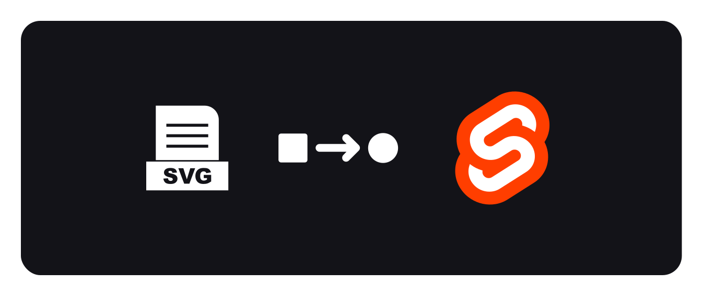

# SVG to Svelte



A simple CLI tool to create Svelte components from SVG's<sup>1</sup>

_This tool is in currently in beta so please report any bugs or issues 🙏_

## Get started

To begin first open your chosen terminal and navigate to the directory of SVG's in your project.

```sh
cd <your project svg directory>
```

Once there run the following command.

```sh
npx svg-svelte
```

This will search the current directory for SVG files (not subdirectories yet) and output a Svelte component for each SVG. These components are placed into a new folder named `output`.

You can then move the Svelte files to wherever you need them in the project and use them as you would any other Svelte component:

```svelte
<script>
  import Icon from './components/awesome-icon.svelte'
</script>

<Icon width={24} height={24} fill="#FF3E00" />
```

### Caveats

In its current state this tool is really only suited to single colour icons. During the conversion process it will overwrite any different fills you have on different paths.

It has also not been tested on more complex SVG's yet.

## Roadmap

Here's what I'm planning to add to the tool:

- Input arguments (e.g. `input` and `output` directories)
- Subdirectory support
- Support for more complex svg's

---

<sup>1</sup> Note: I am not affiliated with Svelte
